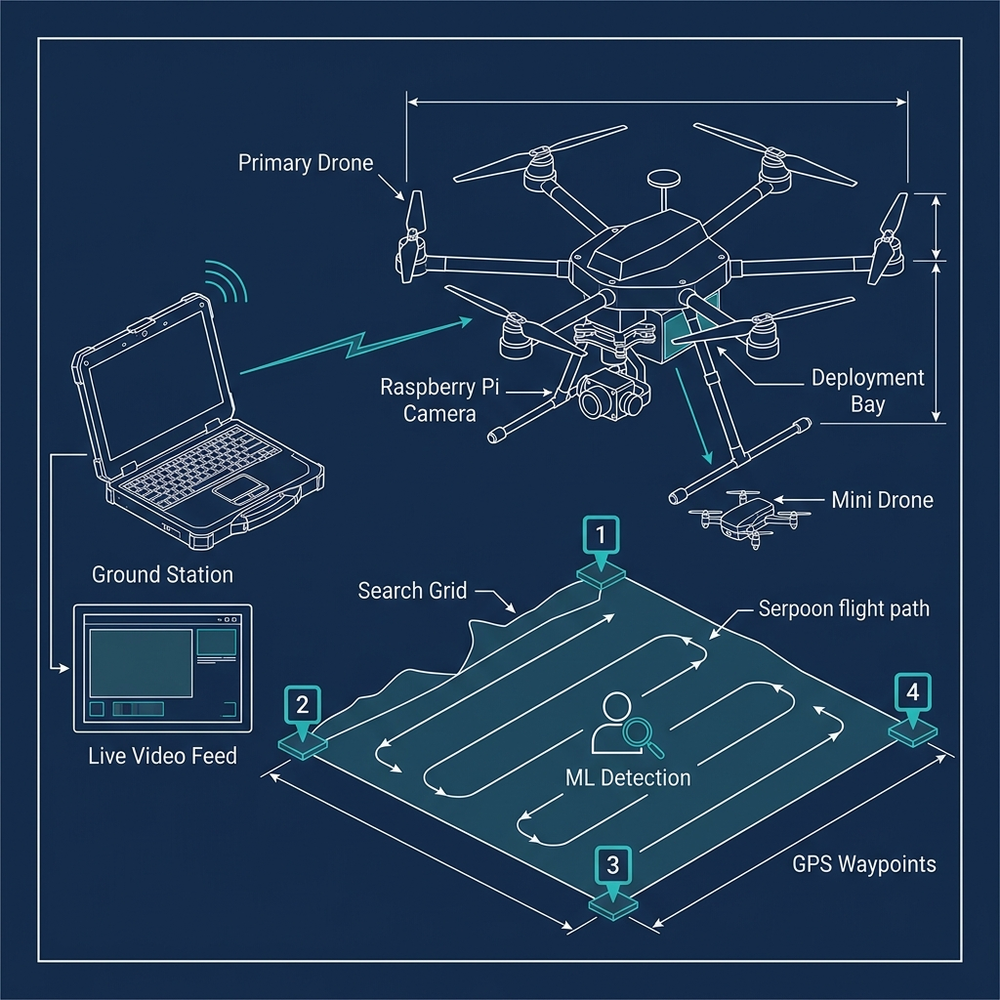
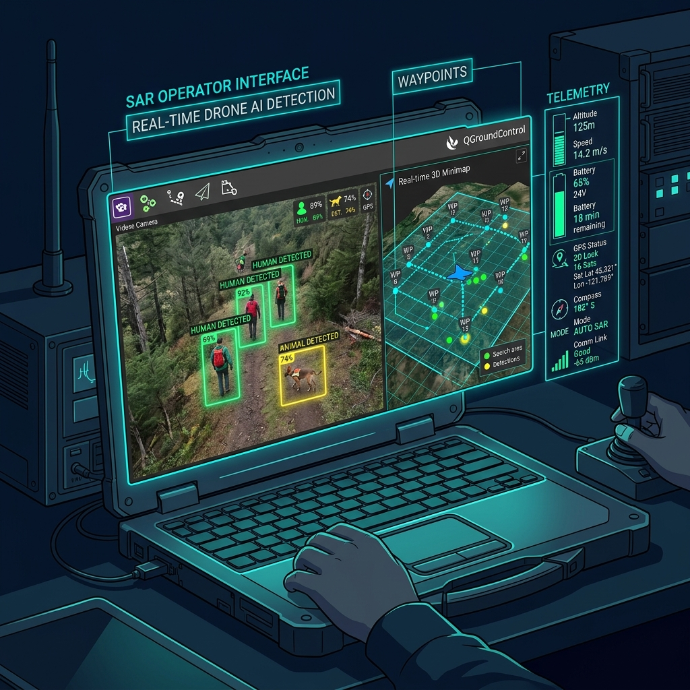
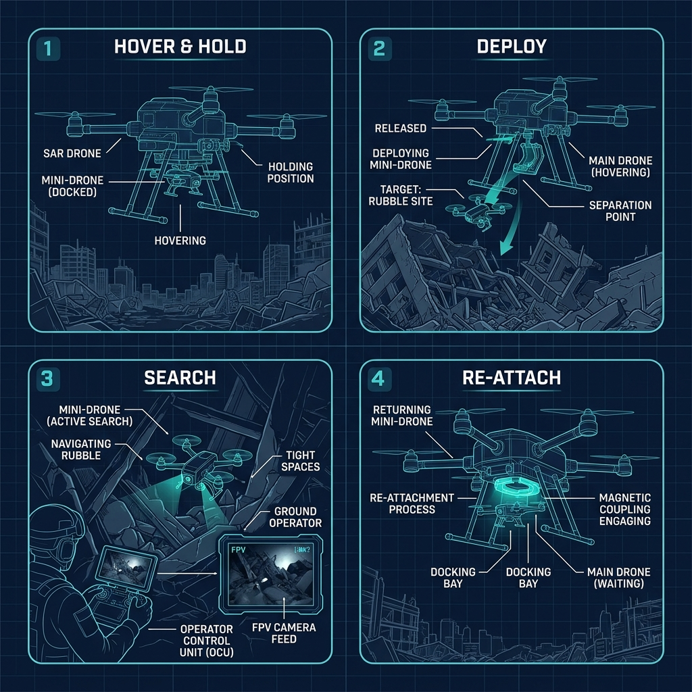
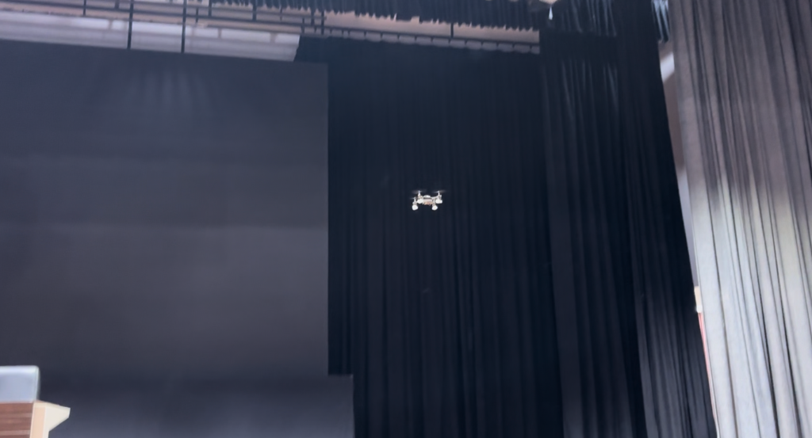
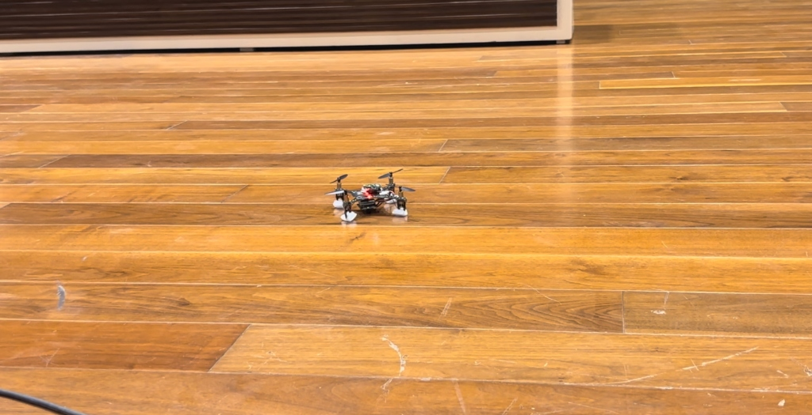
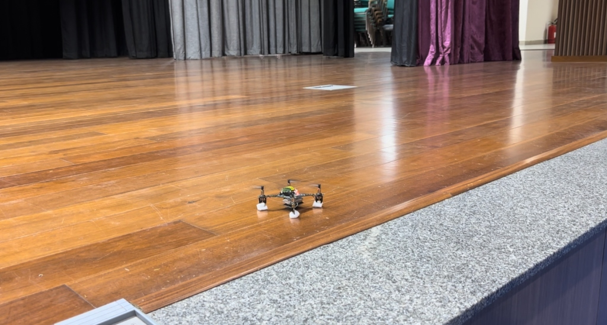
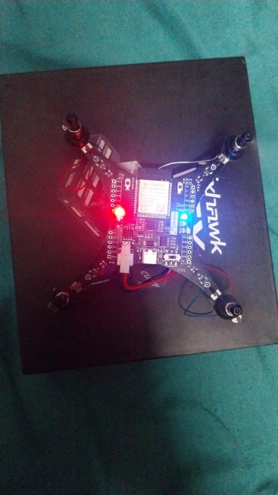

<p align="center">
  
</p>

<h1 align="center">Autonomous Search & Rescue Drone System</h1>

<p align="center">
  <strong>Smart India Hackathon 2025 (SIH) — Team RescueWings</strong><br/>
  <em>Top 180 teams selected out of 900+ competing teams from our college</em>
</p>

<p align="center">
  
  
  
  
  
</p>

---

## Table of Contents

- [Overview](#overview)
- [Problem Statement](#problem-statement)
- [Our Solution](#our-solution)
- [System Architecture](#system-architecture)
- [Key Features](#key-features)
- [Dual-Drone System](#dual-drone-system)
- [Autonomous Area Coverage](#autonomous-area-coverage)
- [ML-Based Detection](#ml-based-detection)
- [Ground Station](#ground-station)
- [Hardware Components](#hardware-components)
- [Software Stack](#software-stack)
- [Simulation & Testing](#simulation--testing)
- [Mini-Drone Deployment Workflow](#mini-drone-deployment-workflow)
- [Hackathon Gallery](#hackathon-gallery)
- [Team](#team)

---

## Overview

A **dual-drone disaster-response platform** built for the **Smart India Hackathon 2025 (SIH 2025)** that autonomously covers a search area defined by four GPS waypoints. The system features a primary search drone equipped with a Raspberry Pi camera for live video transmission to a ground station, where a trained ML model performs real-time aerial detection of humans and animals trapped in disaster zones.

The standout innovation is a **deployable mini-drone** designed for navigating tight, collapsed spaces that the primary drone cannot access — making our system uniquely effective for post-earthquake and building-collapse rescue scenarios.

> **Achievement**: Selected among the **Top 180 teams** out of **900+ competing teams from our college** in the **Smart India Hackathon 2025**.

---

## Problem Statement

During natural disasters — earthquakes, floods, building collapses — traditional search and rescue operations are:

- **Time-critical**: Survivors have limited time (the "Golden 72 Hours")
- **Dangerous**: First responders risk their lives in unstable structures
- **Inefficient**: Manual ground searches cover area slowly
- **Limited**: Large drones cannot navigate collapsed buildings or rubble

There is a critical need for an **autonomous aerial search system** that can:
1. Rapidly cover large disaster-affected areas
2. Detect survivors using AI-powered vision
3. Access confined spaces where humans and large drones cannot reach
4. Provide real-time situational awareness to rescue command centers

---

## Our Solution

<p align="center">
  
</p>

We built a **two-tier drone system** combining autonomous wide-area coverage with manual tight-space exploration:

### Tier 1 — Primary SAR Drone (Autonomous)
- Operator defines a search zone by providing **4 GPS waypoints**
- The drone autonomously computes a **serpentine/lawnmower flight path** to ensure complete area coverage
- A bottom-mounted **Raspberry Pi camera** streams live video to the ground station
- An **ML model** (trained on aerial disaster imagery) processes the feed in real-time, detecting humans and animals

### Tier 2 — Mini Drone (Manually Operated)
- When the primary drone encounters a **collapsed structure or confined space** it cannot enter:
  - The primary drone **hovers in place** and holds position
  - A **mini-drone is deployed** (dropped) from the primary drone
  - The operator **manually controls** the mini-drone to navigate tight spaces
  - The mini-drone's camera feed is also sent to the ground station for ML analysis
  - Once the tight-space search is complete, the mini-drone **re-attaches** to the primary drone
  - The primary drone **resumes its autonomous search pattern**

---

## System Architecture

```
┌─────────────────────────────────────────────────────────────────┐
│                        GROUND STATION                           │
│  ┌──────────────┐  ┌──────────────────┐  ┌──────────────────┐  │
│  │ QGroundControl│  │  ML Detection    │  │ Mission Control  │  │
│  │  - Telemetry  │  │  - YOLOv8 Model  │  │  - GPS Waypoints │  │
│  │  - Mission    │  │  - Human Detect  │  │  - Flight Path   │  │
│  │  - Parameters │  │  - Animal Detect │  │  - Alerts        │  │
│  └──────┬───────┘  └────────┬─────────┘  └──────────────────┘  │
│         │                   │                                    │
└─────────┼───────────────────┼────────────────────────────────────┘
          │ MAVLink           │ Video Stream
          │                   │
     ┌────┴───────────────────┴────┐
     │    COMMUNICATION LINK       │
     │  (Wi-Fi / Telemetry Radio)  │
     └────┬───────────────────┬────┘
          │                   │
┌─────────┴───────────────────┴────────────────────────────────────┐
│                      PRIMARY DRONE                                │
│  ┌──────────────┐  ┌──────────────┐  ┌────────────────────────┐  │
│  │  Pixhawk FC  │  │ Raspberry Pi │  │  Mini-Drone Dock       │  │
│  │  - PX4 FW    │  │  - Camera    │  │  - Magnetic Coupling   │  │
│  │  - GPS       │  │  - Streaming │  │  - Release Mechanism   │  │
│  │  - IMU       │  │  - Encoding  │  │  - Power Interface     │  │
│  └──────────────┘  └──────────────┘  └───────────┬────────────┘  │
│                                                   │               │
└───────────────────────────────────────────────────┼───────────────┘
                                                    │
                                              ┌─────┴──────┐
                                              │ MINI DRONE  │
                                              │ - Camera    │
                                              │ - FPV Feed  │
                                              │ - Manual RC │
                                              └─────────────┘
```

For a detailed breakdown, see [docs/system-architecture.md](docs/system-architecture.md).

---

## Key Features

| Feature | Description |
|---------|------------|
| **4-Point GPS Coverage** | Define any quadrilateral search zone using four GPS coordinates; the drone auto-generates a complete coverage path |
| **Autonomous Flight** | Fully autonomous serpentine search pattern with no manual intervention required |
| **Live Video Streaming** | Raspberry Pi camera streams real-time aerial footage to the ground station |
| **ML Human/Animal Detection** | Trained detection model identifies survivors and animals from aerial footage |
| **Mini-Drone Deployment** | Deployable mini-drone for exploring collapsed structures and tight spaces |
| **Mid-Mission Re-attach** | Mini-drone docks back to the primary drone for seamless mission continuation |
| **Ground Station Integration** | QGroundControl-based mission planning, telemetry monitoring, and alert system |
| **HITL Simulation** | Validated using PX4 Hardware-In-The-Loop simulation before real flights |

---

## Dual-Drone System

<p align="center">
  
</p>

### Primary Drone
- **Frame**: Hexacopter configuration for stability and payload capacity
- **Flight Controller**: Pixhawk running PX4 autopilot firmware
- **Navigation**: GPS + compass module for autonomous waypoint navigation
- **Camera**: Raspberry Pi Camera Module mounted on the underside
- **Payload**: Carries the mini-drone in a custom docking bay

### Mini Drone
- **Purpose**: Navigate confined spaces (collapsed buildings, rubble, dense vegetation)
- **Control**: Manually operated via FPV controller from the ground station
- **Camera**: Onboard camera with live feed to ground station
- **Docking**: Magnetic coupling mechanism for attachment/detachment to the primary drone
- **Size**: Compact form factor designed to fit through gaps and openings

---

## Autonomous Area Coverage

The operator defines a rectangular search area by inputting **4 GPS waypoints** (corners). The system then:

1. **Computes the bounding polygon** from the four coordinates
2. **Generates a serpentine (lawnmower) flight path** that ensures every part of the area is covered
3. **Accounts for camera FOV** to prevent gaps in coverage
4. **Uploads the mission** to the flight controller via MAVLink
5. **Executes autonomously** — the drone follows the path, hovering at optimal altitude for detection

```
   WP1 ●━━━━━━━━━━━━━━━━━━━━━━━━━━━● WP4
       ┃ → → → → → → → → → → → → ┃
       ┃                            ┃
       ┃ ← ← ← ← ← ← ← ← ← ← ← ┃
       ┃                            ┃
       ┃ → → → → → → → → → → → → ┃
       ┃                            ┃
       ┃ ← ← ← ← ← ← ← ← ← ← ← ┃
       ┃                            ┃
       ┃ → → → → → → → → → → → → ┃
       ┃                            ┃
   WP2 ●━━━━━━━━━━━━━━━━━━━━━━━━━━━● WP3

   [Serpentine/Lawnmower Coverage Pattern]
```

---

## ML-Based Detection

### Model Architecture
- **Base Model**: YOLOv8 (You Only Look Once v8) — optimized for real-time object detection
- **Training Data**: Aerial disaster imagery datasets including drone-captured footage of disaster sites
- **Detection Classes**:
  - **Human** — survivors, injured persons, people signaling for help
  - **Animal** — pets and livestock that may need rescue

### Detection Pipeline

```
Drone Camera (Raspberry Pi)
        │
        ▼
  Video Stream (RTSP/UDP)
        │
        ▼
  Ground Station Receiver
        │
        ▼
  Frame Extraction
        │
        ▼
  YOLOv8 Inference Engine
        │
        ├──→ Human Detected → Alert + GPS Tag
        ├──→ Animal Detected → Alert + GPS Tag
        └──→ No Detection → Continue Scanning
```

### Key ML Features
- **Real-time inference** at 15-30 FPS on the ground station GPU
- **Confidence thresholds** to minimize false positives in complex disaster scenes
- **GPS tagging** of detections — each detection is logged with the drone's GPS position at the time of detection
- **Alert system** — immediate visual and audio alerts when a survivor is detected

---

## Ground Station

The ground station is the command center for the entire operation, running on a laptop:

### Components
| Component | Tool/Software | Purpose |
|-----------|--------------|---------|
| Mission Planning | QGroundControl | Define waypoints, flight path, parameters |
| Flight Telemetry | QGroundControl | Real-time altitude, speed, battery, GPS |
| Video Feed | Custom Python App | Receive and display live drone camera feed |
| ML Detection | YOLOv8 + OpenCV | Process video frames and detect survivors |
| Alert Dashboard | Custom UI | Log detections with GPS, timestamp, confidence |

### Communication
- **Telemetry**: MAVLink protocol over telemetry radio (433/915 MHz)
- **Video**: Wi-Fi streaming from Raspberry Pi (RTSP/UDP protocol)
- **Mini-Drone Control**: Separate RC channel for manual FPV operation

---

## Hardware Components

### Primary Drone

| Component | Specification |
|-----------|--------------|
| Frame | Hexacopter (F550 or custom) |
| Flight Controller | Pixhawk 4 / Cube Orange |
| Firmware | PX4 Autopilot |
| GPS | u-blox M8N with compass |
| Motors | 2212 920KV brushless (x6) |
| ESCs | 30A BLHeli (x6) |
| Battery | 4S 5000mAh LiPo |
| Camera | Raspberry Pi Camera Module v2 |
| Companion Computer | Raspberry Pi 4 (4GB) |
| Telemetry | SiK Radio 915MHz |
| Mini-Drone Dock | Custom 3D-printed mount with servo-actuated release |

### Mini Drone

| Component | Specification |
|-----------|--------------|
| Frame | Micro quadcopter (~100mm) |
| Flight Controller | Lightweight FC (e.g., BetaFlight) |
| Camera | Micro FPV camera |
| Motors | 0802/1103 brushless (x4) |
| Battery | 1S 450mAh LiPo |
| Receiver | FrSky/ELRS micro RX |
| Docking Mechanism | Neodymium magnets + alignment pins |

### Ground Station

| Component | Specification |
|-----------|--------------|
| Laptop | GPU-enabled (for ML inference) |
| Software | QGroundControl + Custom Python app |
| RC Controller | FrSky Taranis / RadioMaster (for mini-drone) |
| Telemetry Radio | SiK Radio 915MHz (paired with drone) |
| Wi-Fi Receiver | For Raspberry Pi video stream |

---

## Software Stack

| Layer | Technology | Purpose |
|-------|-----------|---------|
| Flight Firmware | PX4 Autopilot | Autonomous flight control, waypoint navigation |
| Companion OS | Raspberry Pi OS | Camera streaming, onboard processing |
| Video Streaming | GStreamer / FFmpeg | Encode and stream video from Pi to GCS |
| Communication | MAVLink / MAVSDK | Drone-to-GCS command and telemetry protocol |
| Ground Station | QGroundControl | Mission planning, monitoring, parameter tuning |
| ML Framework | PyTorch / Ultralytics | YOLOv8 model training and inference |
| Computer Vision | OpenCV | Frame processing, annotation, display |
| Simulation | PX4 SITL/HITL + Gazebo | Virtual flight testing before real deployment |
| Mission Script | Python (MAVSDK) | Custom autonomous mission logic |

---

## Simulation & Testing

### PX4 Hardware-In-The-Loop (HITL) Simulation

Before flying the real drone, we validated the entire system using **PX4 HITL simulation**:

1. **HITL Setup**: Connected the Pixhawk flight controller to the PX4 simulator via USB — the real FC runs the firmware while the physics are simulated
2. **QGroundControl Testing**: Used QGC to:
   - Upload 4-waypoint missions
   - Verify serpentine path generation
   - Test autonomous takeoff, mission execution, and RTL (Return to Launch)
   - Monitor telemetry data integrity
3. **Failsafe Validation**: Tested behavior on:
   - GPS loss
   - Low battery
   - Communication link failure
   - Geofence breach
4. **Camera Integration Test**: Verified Raspberry Pi camera stream reaches the ground station during simulated flights

### Simulation Tools

| Tool | Purpose |
|------|---------|
| PX4 HITL | Hardware-in-the-loop flight simulation with real FC |
| PX4 SITL | Software-in-the-loop simulation (fully virtual) |
| Gazebo | 3D physics simulation environment |
| QGroundControl | Mission planning and flight validation |
| jMAVSim | Lightweight MAVLink simulator for quick tests |

---

## Mini-Drone Deployment Workflow

This is the complete operational workflow for deploying the mini-drone during a rescue mission:

```
┌─────────────────────────────────────────────────────┐
│              NORMAL AUTONOMOUS SEARCH               │
│   Primary drone follows serpentine search pattern    │
└──────────────────────┬──────────────────────────────┘
                       │
                       ▼
          ┌────────────────────────┐
          │  Obstacle/Structure    │
          │  detected that drone   │──── No ──→ Continue Search
          │  cannot enter?         │
          └────────────┬───────────┘
                       │ Yes
                       ▼
          ┌────────────────────────┐
          │  PRIMARY DRONE HOVERS  │
          │  Holds GPS position    │
          │  Maintains altitude    │
          └────────────┬───────────┘
                       │
                       ▼
          ┌────────────────────────┐
          │  DEPLOY MINI-DRONE     │
          │  Servo releases dock   │
          │  Mini-drone drops      │
          │  Operator takes manual │
          │  FPV control           │
          └────────────┬───────────┘
                       │
                       ▼
          ┌────────────────────────┐
          │  MINI-DRONE SEARCH     │
          │  Navigate tight spaces │
          │  Camera feed → GCS     │
          │  ML detection active   │
          └────────────┬───────────┘
                       │
                       ▼
          ┌────────────────────────┐
          │  RE-ATTACH TO PRIMARY  │
          │  Mini-drone returns    │
          │  Magnetic coupling     │
          │  engages dock          │
          └────────────┬───────────┘
                       │
                       ▼
          ┌────────────────────────┐
          │  RESUME AUTONOMOUS     │
          │  Primary drone resumes │
          │  serpentine pattern    │
          │  from last position    │
          └────────────────────────┘
```

---

## Hackathon Gallery

Real photos from the **Smart India Hackathon 2025** — our mini-drone in action during the demo:

<p align="center">
  
</p>
<p align="center"><em>Mini-drone in flight during the SIH live demonstration</em></p>

<br/>

<p align="center">
  
</p>
<p align="center"><em>Mini-drone on the ground — custom-built micro quadcopter with FPV camera</em></p>

<br/>

<p align="center">
  
</p>
<p align="center"><em>Mini-drone on the hackathon stage — ready for the live demo</em></p>

<br/>

<p align="center">
  
</p>
<p align="center"><em>Pixhawk flight controller with electronics — the brain of the drone powered up and ready</em></p>

<br/>

### Live Demo Video

> **[Watch the live flight demo video (MP4)](https://github.com/Shivanshtripathi03/Autonomous-Search-Rescue-Drone-SIH/raw/main/assets/hackathon_drone_demo.mp4)** — Mini-drone flight during the Smart India Hackathon 2025 showcasing autonomous flight capabilities.

---

## Team

**Team Name**: RescueWings

| Role | Responsibility |
|------|---------------|
| Drone Engineer | Frame assembly, motor calibration, flight tuning |
| Embedded Systems | Raspberry Pi setup, camera integration, streaming |
| ML Engineer | YOLOv8 training, detection pipeline, optimization |
| Flight Software | PX4 configuration, MAVSDK mission scripts, HITL testing |
| Mini-Drone Specialist | Mini-drone build, docking mechanism, FPV setup |
| Ground Station | QGC configuration, custom GCS dashboard, integration |

---

## Documentation

- [System Architecture Details](docs/system-architecture.md)
- [Hardware Setup Guide](docs/hardware-setup.md)
- [Software & ML Pipeline](docs/software-ml-pipeline.md)
- [Mini-Drone System](docs/mini-drone-system.md)
- [Simulation & Testing Guide](docs/simulation-testing.md)

---

## License

This project was built as part of the **Smart India Hackathon 2025 (SIH 2025)** competition. The documentation and design materials in this repository are shared for educational and portfolio purposes.

---

<p align="center">
  <strong>Built by Team RescueWings for Smart India Hackathon 2025</strong>
</p>
